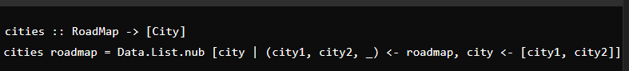
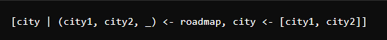
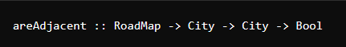
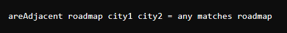
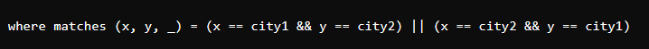
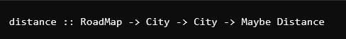
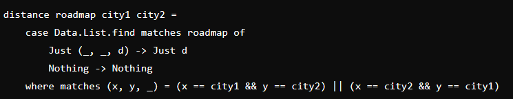

# Group T16_07

- **City** = String --> nome de uma cidade
- **Path** = Lista de cidades --> sequência de cidades
- **Distance** = Int --> distância entre duas cidades
- **RoadMap** = Lista de tuplos --> mapa rodoviário, onde cada tuplo conecta duas cidades e inclui as distências entre elas

&nbsp;

- Função que extrai uma lista de todas as cidades mencionadas no mapa rodoviário, removendo as duplicadas

&nbsp;

- Significa que para cada tuplo no **roadmap**, ele retorna ambos os valores *city1* e *city2*

&nbsp;

- **RoadMap** = Lista de tuplos --> Cada tuplo indica que duas cidades estão conectadas por uma estrada de uma certa distância
- **City** = String --> Cidades
- **Bool** = Bool --> Indica se as duas estão diretamente conectadas

&nbsp;

- A função usa *any*, que verifica se algum elemento de uma lista satisfaz uma condição. Aqui queremos verificar se algum tuplo no **roadmap** corresponde à condição descrita pela função **matches**

&nbsp;

- *x* e *y* são duas cidades conectadas e o terceiro valor *_* é a distância
- Retorna *True* se a *x* é a mesma que *city1* e *y* a mesma que *city2* ou vice-versa

&nbsp;

- **RoadMap** = Lista de tuplos --> Cada tuplo indica que duas cidades estão conectadas por uma estrada e inclui a distância entre elas
- **City** --> As duas cidades para as quais queremos saber a distância
- **Maybe Distance** --> Pode retornar um valor de distância (*Just Distance*) se as cidades estiverem conectadas, ou *Nothing* se isso não se verificar

&nbsp;

- **Data.List.find matches roadmap** --> Procura no roadmap um tuplo (x, y, d) onde *x* e *y* são as cidades e *d* é a distância entre elas. A função **find** retorna o *primeiro elemento* que faz o *match* ou *Nothing* se nenhuma tupla satisfizer a condição